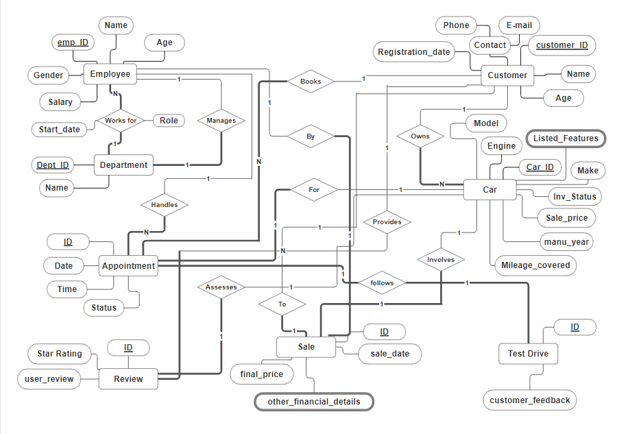

# ER Diagram & Relational Mapping

## ER Diagram

### Entities Present

- **Employee**
- **Department**
- **Appointment**
- **Review**
- **Sale**
- **Customer**
- **Car**
- **Test Drive**

### Relationships Present

#### One-to-Many

- **WORKS_FOR**: Employee & Department (1:N)
- **HANDLES**: Employee & Appointment (1:N)
- **BOOKS**: Customer & Appointment (1:N)
- **PROVIDES**: Customer & Review (1:N)
- **OWNS**: Customer & Car (1:N)

#### One-to-One

- **MANAGES**: Employee & Department (1:1) (partial: employee, total: department)
- **ASSESSES**: Review & Car (1:1) (partial: review, total: car)
- **SALE_TO**: Sale & Customer (1:1) (partial: customer, total: sale)
- **SALE_BY**: Sale & Employee (1:1) (partial: employee, total: sale)
- **APPOINTMENT_FOR**: Appointment & Car (1:1) (partial: car, total: appointment)
- **FOLLOWS**: Test Drive & Appointment (1:1) (both total)
- **INVOLVES**: Sale & Car (1:1) (partial: car, total: sale)

## Mapping ER Diagram to Relational Schema

1. Mapping of Strong Entity Types

   - **Employee**
     | <ins>emp_ID</ins> | Name | Age | Gender | Salary |
     | ----------------- | ---- | --- | ------ | ------ |

   - **Department**
     | <ins>dept_ID</ins> | Name |
     | ------------------ | ---- |

   - **Appointment**
     | <ins>app_ID</ins> | Date | Time | Status |
     | ------------------ | ---- | --- | ------ |

   - **Review**
     | <ins>review_ID</ins> | Star_Rating | User_Review |
     | -------------------- | ----------- | ----------- |

   - **Sale**
     | <ins>sale_ID</ins> | sale_date | final_price | payment_method |
     | ------------------ | --------- | ----------- | -------------- |

     (other_finance_details is a multivalued attribute)

   - **Customer**
     | <ins>customer_ID</ins> | Name | Age | Phone | Email | Registration_Date |
     | ---------------------- | ---- | --- | ----- | ----- | ----------------- |

   - **Car**
     | <ins>car_ID</ins> | Model | Engine | Make | Inventory_Status | Sale_Price | maufacture_year | Mileage_covered |
     | ----------------- | ----- | ------ | ---- | ---------------- | ---------- | ------- | ---------------- |

     (Listed_Features is a multivalued attribute)

   - **Test Drive**
     | <ins>test_drive_ID</ins> | customer_feedback |
     | ------------------------ | ----------------- |

2. Mapping of Weak Entity Types

   **None**

3. Mapping of Binary 1:N Relationship Types

   - **WORKS_FOR**  
     **Employee**
     | <ins>emp_ID</ins> | ... | works_for_dept_id |
     | ----------------- | --- | ------- |

     FK: `employee.works_for_dept_id` references `department.dept_ID`

   - **HANDLES**  
     **Appointment**
     | <ins>app_ID</ins> | ... | handling_emp_id |
     | ----------------- | --- | ------ |

     FK: `appointment.handling_emp_id` references `employee.emp_ID`

   - **BOOKS**  
     **Appointment**
     | <ins>app_ID</ins> | ... | booking_cust_id |
     | ----------------- | --- | ----------- |

     FK: `appointment.booking_cust_id` references `customer.customer_ID`

   - **PROVIDES**  
     **Review**
     | <ins>review_ID</ins> | ... | review_cust_id |
     | -------------------- | --- | ----------- |

     FK: `review.review_cust_id` references `customer.customer_ID`

   - **OWNS**  
     **Car**
     | <ins>car_ID</ins> | ... | owner_cust_id |
     | ----------------- | --- | ----------- |

     FK: `car.owner_cust_id` references `customer.customer_ID`

4. Mapping of Binary 1:1 Relationship Types

   - **MANAGES**  
     **Department**
     | <ins>dept_ID</ins> | ... | manager_emp_id |
     | ------------------ | --- | -------------- |

     FK: `department.manager_emp_id` references `employee.emp_ID`

   - **ASSESSES**  
     **Review**
     | <ins>review_ID</ins> | ... | assessed_car_id |
     | -------------------- | --- | --------------- |

     FK: `review.assessed_car_id` references `car.car_ID`

   - **SALE_TO**  
     **Sale**
     | <ins>sale_ID</ins> | ... | sale_to_cust_id |
     | ------------------ | --- | --------------- |

     FK: `sale.sale_to_cust_id` references `customer.customer_ID`

   - **SALE_BY**  
     **Sale**
     | <ins>sale_ID</ins> | ... | sale_by_emp_id |
     | ------------------ | --- | -------------- |

     FK: `sale.sale_by_emp_id` references `employee.emp_ID`

   - **APPOINTMENT_FOR**  
     **Appointment**
     | <ins>app_ID</ins> | ... | appointment_for_car_id |
     | ----------------- | --- | ---------------------- |

     FK: `appointment.appointment_for_car_id` references `car.car_ID`

   - **FOLLOWS**  
     Merge **Appointment** and **Test Drive** tables since they are both total participation
     | <ins>app_ID</ins> | ... | test_drive_ID | ... |
     | ----------------- | --- | ------------- | --- |

     **Test Drive** table is deleted since it is merged with **Appointment** table.

   - **INVOLVES**  
     **Sale**
     | <ins>sale_ID</ins> | ... | sale_involved_car_id |
     | ----------------- | --- | --------------------- |

     FK: `sale.sale_involved_car_id` references `car.car_ID`

5. Mapping of Binary M:N Relationship Types

   **None**

6. Mapping of Multivalued Attributes

   - For **Car**, the multivalued attribute **Listed_Features** is mapped to a separate table **Car_Features** with the following schema:  
     **Car_Features**
     | <ins>feature</ins> | <ins>car_ID</ins> |
     | ------------------ | ----------------- |

     PK: (feature, car_ID)  
     FK: `car_features.car_ID` references `car.car_ID`

   - For **Sale**, the multivalued attribute **other_finance_details** is mapped to a separate table **Sale_Finance_Details** with the following schema:  
     **Sale_Finance_Details**
     | <ins>finance_detail</ins> | <ins>sale_ID</ins> |
     | ------------------------- | ------------------ |

     PK: (finance_detail, sale_ID)  
     FK: `sale_finance_details.sale_ID` references `sale.sale_ID`

7. Mapping of N-ary Relationship Types

   **None**

## Final Relations produced

### Employee

| <ins>emp_ID</ins> | Name | Age | Gender | Salary | works_for_dept_id |
| ----------------- | ---- | --- | ------ | ------ | ----------------- |

PK: emp_ID  
FK: `employee.works_for_dept_id` references `department.dept_ID`

### Department

| <ins>dept_ID</ins> | Name | manager_emp_id |
| ------------------ | ---- | -------------- |

PK: dept_ID  
FK: `department.manager_emp_id` references `employee.emp_ID`

### Appointment

| <ins>app_ID</ins> | Date | Time | Status | handling_emp_id | booking_cust_id | appointment_for_car_id | test_drive_ID | customer_feedback |
| ----------------- | ---- | ---- | ------ | --------------- | --------------- | ---------------------- | ------------- | ----------------- |

PK: app_ID  
FK: `appointment.handling_emp_id` references `employee.emp_ID`  
FK: `appointment.booking_cust_id` references `customer.customer_ID`  
FK: `appointment.appointment_for_car_id` references `car.car_ID`

### Review

| <ins>review_ID</ins> | Star_Rating | User_Review | review_cust_id | assessed_car_id |
| -------------------- | ----------- | ----------- | -------------- | --------------- |

PK: review_ID  
FK: `review.review_cust_id` references `customer.customer_ID`  
FK: `review.assessed_car_id` references `car.car_ID`

### Sale

| <ins>sale_ID</ins> | sale_date | final_price | payment_method | sale_to_cust_id | sale_by_emp_id | sale_involved_car_id |
| ------------------ | --------- | ----------- | -------------- | --------------- | -------------- | -------------------- |

PK: sale_ID  
FK: `sale.sale_to_cust_id` references `customer.customer_ID`  
FK: `sale.sale_by_emp_id` references `employee.emp_ID`  
FK: `sale.sale_involved_car_id` references `car.car_ID`

### Customer

| <ins>customer_ID</ins> | Name | Age | Phone | Email | Registration_Date |
| ---------------------- | ---- | --- | ----- | ----- | ----------------- |

PK: customer_ID

### Car

| <ins>car_ID</ins> | Model | Engine | Make | Inventory_Status | Sale_Price | maufacture_year | Mileage_covered | owner_cust_id |
| ----------------- | ----- | ------ | ---- | ---------------- | ---------- | --------------- | --------------- | ------------- |

PK: car_ID  
FK: `car.owner_cust_id` references `customer.customer_ID`

### Car_Features

| <ins>feature</ins> | <ins>car_ID</ins> |
| ------------------ | ----------------- |

PK: (feature, car_ID)  
FK: `car_features.car_ID` references `car.car_ID`

### Sale_Finance_Details

| <ins>finance_detail</ins> | <ins>sale_ID</ins> |
| ------------------------- | ------------------ |

PK: (finance_detail, sale_ID)  
FK: `sale_finance_details.sale_ID` references `sale.sale_ID`
